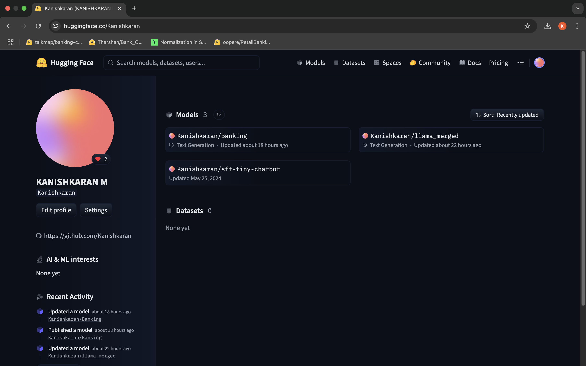
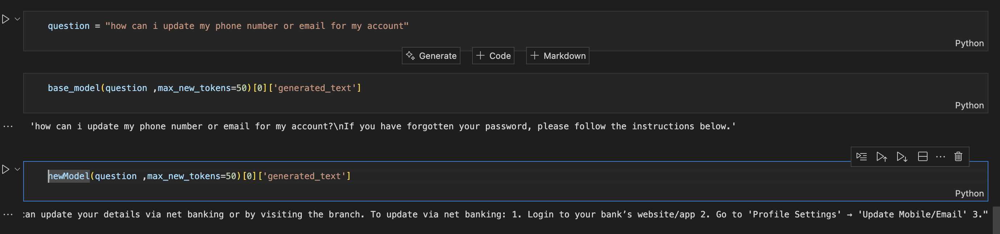

# Gen-AI Task

##  Semantic Kernel 

It is an open-source SDK from Microsoft that enables developers to integrate AI models, such as large language models (LLMs), into their .NET applications. It provides abstractions for chat completion, semantic memory etc, making it easier to build intelligent applications that leverage AI capabilities.

## Approach 1 :)
---

- Here I used Ollama, which is a software to run Large Language Models **locally**, this promotes security over the traditional api calls. :>
- Its a simple model call with a *System Prompt*


## Program.cs and OllamaChatService Injection

the Semantic Kernel's Ollama chat completion service is registered for dependency injection:

```csharp
// filepath: BankApi/Program.cs
builder.Services.AddOllamaChatCompletion(
    modelId: "llama3.2:3b",
    endpoint: new Uri("http://localhost:11434")  // default port where ollama runs
);
```

- **OllamaChatCompletion:** This line registers the Ollama chat completion service, specifying the model and endpoint. This service is then injected into controllers like `ChatController` via the `IChatCompletionService` interface.

---

## ChatController

The [`ChatController`](BankApi/Controllers/ChatController.cs) exposes an API endpoint for chat-based interactions using an AI model. It utilizes the `IChatCompletionService` from Semantic Kernel to process user queries and generate responses.

- **Dependency Injection:** The controller receives an `IChatCompletionService` instance via constructor injection.
- **Chat History:** Maintains a `ChatHistory` object to keep track of the conversation context.
- **POST Endpoint:** The `/api/chat` endpoint accepts a user question, adds it to the chat history, and returns the AI-generated response.

**Key code:**
```csharp
// filepath: BankApi/Controllers/ChatController.cs
public ChatController(IChatCompletionService service)
        {
            _chatService = service;
            _chatMessages =
            [
                new()
                {
                    Role = AuthorRole.System,
                    Content = "You are a helpful Banking Assistant who helps customers with their queries. Provide relevant answer and be polite. Answer all the customer's queries. You are also a chatbot who answers FAQs "
                }
,
            ];
        }

        [HttpPost]
        public async Task<ActionResult<ChatMessageContent>> Chat([FromBody] Question question)
        {

            _chatMessages.AddUserMessage(question.UserQuestion);
            var result = await _chatService.GetChatMessageContentAsync(_chatMessages);
            
            return Ok(result.Content);
        }
```

---

## Approach 2 :)

- system prompt can be a basic solution for this use case
- RAG or Retrieval Augmented Generation can also be used,  where we retrieve info from documents.

- This approach I used to solve the problem is by using fine-tuning.

*Fine-tuning* on models can be done for a domain specific task like banking, medical or acedamic chatbot.

I used a open-source hugging face model: llama3.2:1B which is a small model.

This model is trained on following datas

- [Dataset-1]("https://huggingface.co/datasets/Tharshan/Bank_Query")
   
- [Dataset-2]("https://huggingface.co/datasets/oopere/RetailBanking-Conversations")

Here Lora a Parameter Efficient Fine-tuning method is used.

## Breif about LoRA

- **LoRA:** LoRA is a parameter-efficient fine-tuning method for large language models. Instead of updating all model weights, LoRA introduces trainable low-rank matrices into each layer, significantly reducing the number of parameters to train and making fine-tuning more efficient.


The Trained Models are Pushed to Huggingface merged with adapters




### Sample Output



---
