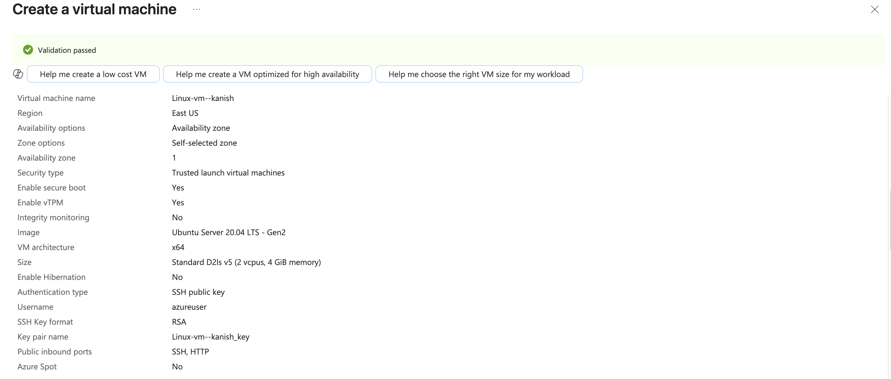
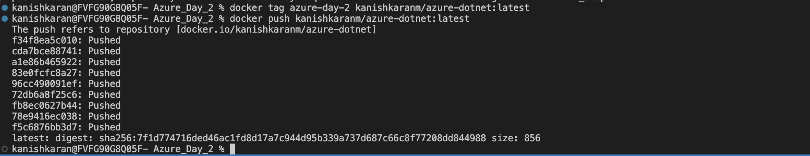
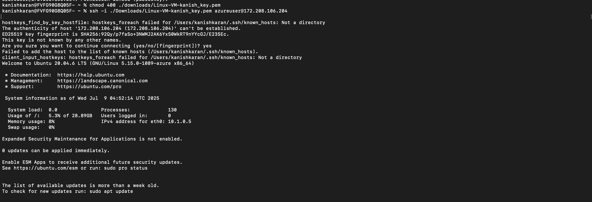
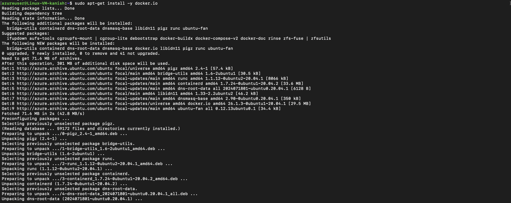
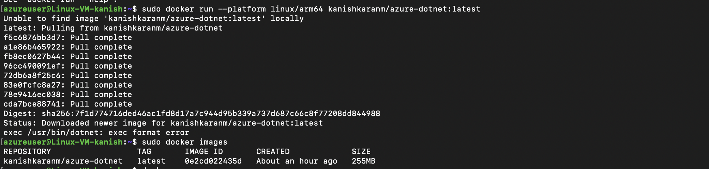
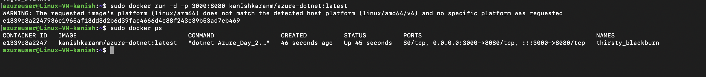
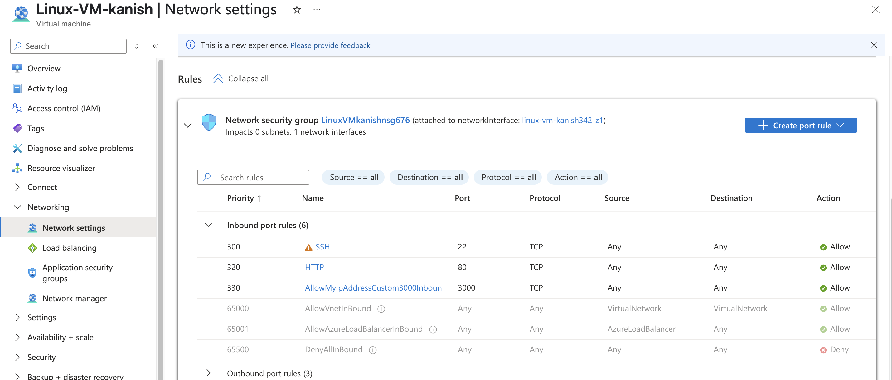
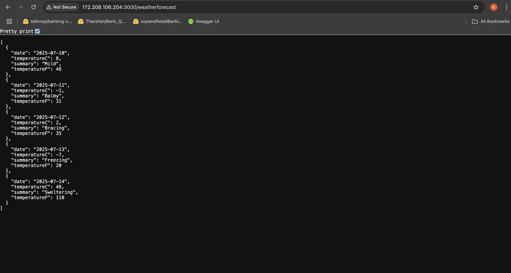

#  Assignment: Deploy a .NET API on Azure Virtual Machine Using Docker 

The below is the step by step process of this assignment completion

## 1. Creating a virtual machine
Created a image with following configuration
- Provision a Linux Virtual Machine (Ubuntu 20.04 LTS). 
- Configuration: 
    1. Public IP Address: Static 
    2. Inbound Ports: Allow SSH (port 22) and HTTP (port 80) 
    3. Size: B1s or larger 




## 2.Created a .Net Web API and dockerised it

The following is the dockerfile of the dotnet application

```
FROM mcr.microsoft.com/dotnet/sdk:9.0@sha256:3fcf6f1e809c0553f9feb222369f58749af314af6f063f389cbd2f913b4ad556 AS build
WORKDIR /App


COPY . ./

RUN dotnet restore

RUN dotnet publish -o out


FROM mcr.microsoft.com/dotnet/aspnet:9.0@sha256:b4bea3a52a0a77317fa93c5bbdb076623f81e3e2f201078d89914da71318b5d8
WORKDIR /App
COPY --from=build /App/out .

EXPOSE 80
ENTRYPOINT ["dotnet", "Azure_Day_2.dll"]

```


## 3. Pushing the local image to hub

Tagging the local image and pushing to the docker hub
This requires to perform `docker login`




## 4. Connecting Virtual Machine using `SSH` and Installation & Verification of Docker

The downloaded .pem file is used to establish connection with the virtual machine



Then Docker is downloaded and installation is verified



Verification of installation of docker


## 5. Pulling Image in Virtual Machine 




## 6. Running the Image and Creating a Inbound Rule to Expose port 3000


Running the image in virtual Machine




Creating a Inbound rule to export port 3000 to any source with tcp connection




## 7. Local View of the container in the virtual machine

